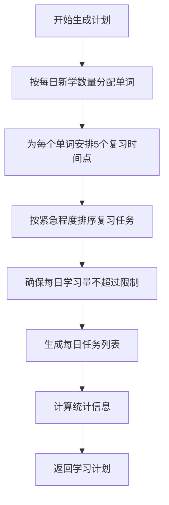

# <div align="center">📚 RememberWords</div>
<div align="center">
  <strong>基于艾宾浩斯遗忘曲线的智能学习计划工具</strong>
</div>

<div align="center">

[](https://github.com/your-username/rememberWords/actions)
[](LICENSE)
[](CONTRIBUTING.md)

[](https://vuejs.org/)
[](https://www.typescriptlang.org/)
[](https://element-plus.org/)
[](https://vitejs.dev/)

</div>

## ✨ 特性

🧠 **科学算法** - 基于艾宾浩斯遗忘曲线的 1、2、4、7、15 天复习间隔
📊 **数据管理** - 支持 Excel 导入导出，智能识别数据格式
🎨 **用户友好** - 三步操作流程，可视化统计图表，响应式设计
🔒 **安全可靠** - 本地存储，输入验证，XSS 防护，类型安全

---

## 📋 目录

- [快速开始](#-快速开始)
- [功能演示](#-功能演示)
- [核心算法](#-核心算法)
- [技术栈](#️-技术栈)
- [项目结构](#-项目结构)
- [使用指南](#-使用指南)
- [开发文档](#-开发文档)
- [贡献指南](#-贡献指南)
- [许可证](#-许可证)

## 🚀 快速开始

### 📋 环境要求

- Node.js >= 16.0.0
- npm >= 8.0.0 或 yarn >= 1.22.0
- 现代浏览器（Chrome 90+, Firefox 88+, Safari 14+）

### ⚡ 安装运行

```bash
# 克隆项目
git clone https://github.com/your-username/rememberWords.git
cd rememberWords

# 安装依赖
npm install

# 启动开发服务器
npm run dev

# 构建生产版本
npm run build
```

访问 [http://localhost:3000](http://localhost:3000) 查看应用。

## 🎬 功能演示

### 📊 学习计划统计
<div align="center">
  
</div>

### 📅 日历视图
<div align="center">
  
</div>

### 📋 列表视图
<div align="center">
  
</div>

## 🧠 核心算法

### 艾宾浩斯遗忘曲线

系统采用经典的艾宾浩斯遗忘曲线复习间隔：

| 复习次数 | 间隔时间 | 记忆保持率 |
|---------|---------|-----------|
| 第1次 | 1天 | 58% |
| 第2次 | 2天 | 84% |
| 第3次 | 4天 | 86% |
| 第4次 | 7天 | 92% |
| 第5次 | 15天 | 96% |

### 算法流程



## 🛠️ 技术栈

### 前端框架
- **[Vue 3](https://vuejs.org/)** - 渐进式JavaScript框架，使用Composition API
- **[TypeScript](https://www.typescriptlang.org/)** - JavaScript的超集，提供静态类型检查
- **[Element Plus](https://element-plus.org/)** - 基于Vue 3的现代化UI组件库

### 构建工具
- **[Vite](https://vitejs.dev/)** - 下一代前端构建工具
- **[ESLint](https://eslint.org/)** - JavaScript代码检查工具
- **[Prettier](https://prettier.io/)** - 代码格式化工具

### 数据处理
- **[ECharts](https://echarts.apache.org/)** - 数据可视化图表库
- **[SheetJS](https://sheetjs.com/)** - JavaScript电子表格库

## 📁 项目结构

```
rememberWords/
├── 📄 README.md              # 项目说明文档
├── 📄 LICENSE                # MIT开源许可证
├── 📄 CHANGELOG.md           # 版本变更日志
├── 📁 docs/                  # 详细文档目录
│   ├── 📖 USER_GUIDE.md      # 用户使用手册
│   └── 🛠️ DEVELOPER.md       # 开发者文档
├── 📁 public/                # 静态资源
│   └── 🎨 favicon.ico
├── 📁 src/                   # 源代码
│   ├── 📁 components/        # Vue组件
│   │   ├── 📤 DataImport.vue
│   │   ├── ⚙️ ParameterSettings.vue
│   │   └── 📊 PlanViewer.vue
│   ├── 📁 composables/       # 组合式函数
│   │   ├── 🧠 useEbbinghaus.ts
│   │   ├── 📊 useExcel.ts
│   │   └── 💾 useStorage.ts
│   ├── 📁 types/             # 类型定义
│   │   ├── 📋 index.ts
│   │   └── 📈 excel.ts
│   ├── 📁 utils/             # 工具函数
│   │   └── 🔒 sanitize.ts
│   ├── 🖼️ App.vue            # 主应用组件
│   └── 🚀 main.ts            # 应用入口
├── 📄 package.json           # 项目配置
├── ⚙️ tsconfig.json          # TypeScript配置
├── ⚡ vite.config.ts         # Vite配置
└── 🎨 .eslintrc.cjs          # ESLint配置
```

## 📖 使用指南

### 三步完成学习计划

1. **📤 导入单词数据**
   - 下载Excel模板文件
   - 按照格式填写单词和释义
   - 上传Excel文件进行解析

2. **⚙️ 设置学习参数**
   - 配置学习周期（建议30-90天）
   - 设置每日新学单词数量（建议5-20个）
   - 调整每日最大复习数量（建议10-50个）

3. **📊 查看学习计划**
   - 查看统计概览和学习负荷图表
   - 浏览列表视图或日历视图
   - 导出完整的Excel学习计划

### Excel数据格式

```csv
单词,释义
apple,苹果
book,书
computer,计算机
beautiful,美丽的
important,重要的
```

## 🛠️ 开发文档

### 开发环境

```bash
# 安装依赖
npm install

# 开发模式
npm run dev

# 类型检查
npm run type-check

# 代码检查
npm run lint

# 格式化代码
npm run format
```

### 构建部署

```bash
# 生产构建
npm run build

# 预览构建结果
npm run preview

# 带类型检查的构建
npm run build:check
```

更多详细信息请查看 [📖 开发者文档](docs/DEVELOPER.md)。

## 🤝 贡献指南

我们欢迎所有形式的贡献！请查看 [🤝 贡献指南](CONTRIBUTING.md) 了解如何参与项目开发。

### 贡献方式

- 🐛 报告问题
- 💡 提出新功能建议
- 🔧 提交代码修复
- 📝 完善文档
- ⭐ 给项目点星

## 📄 许可证

本项目采用 [MIT 许可证](LICENSE)。

---

<div align="center">

**如果这个项目对您有帮助，请给它一个 ⭐**

Made with ❤️ by [RememberWords Team](https://github.com/your-username/rememberWords)

</div>