# <div align="center">📚 RememberWords</div>
<div align="center">
  <strong>基于艾宾浩斯遗忘曲线的智能学习计划工具</strong>
</div>

<div align="center">

[](https://github.com/pxvp2008/rememberWords/actions)
[](LICENSE)
[](https://vuejs.org/)
[](https://www.typescriptlang.org/)
[](https://element-plus.org/)
[](https://vitejs.dev/)

</div>

## 大背景

家有一宝，背单词特困户，起初借助大模型为其生成背单词计划，奈何忽悠忽悠，并不稳定，突发灵感，借助claude，写一个小工具岂不更完美。当当当当，RememberWords就此诞生！！！

## ✨ 特性

🧠 **科学算法** - 基于艾宾浩斯遗忘曲线的 1、2、4、7、15 天复习间隔
📊 **数据管理** - 支持 Excel 导入导出，智能识别数据格式
🎨 **用户友好** - 三步操作流程，可视化统计图表，响应式设计
🖥️ **桌面应用** - 支持 macOS 和 Windows 便携版桌面应用，离线使用
🔒 **安全可靠** - 本地存储，输入验证，XSS 防护，类型安全

---

## 📋 目录

- [快速开始](#-快速开始)
- [核心算法](#-核心算法)
- [技术栈](#️-技术栈)
- [项目结构](#-项目结构)
- [使用指南](#-使用指南)
- [桌面应用](#-桌面应用)

## 🚀 快速开始

### 📋 环境要求

- Node.js >= 16.0.0
- npm >= 8.0.0 或 yarn >= 1.22.0
- 现代浏览器（Chrome 90+, Firefox 88+, Safari 14+）

### ⚡ 安装运行

```bash
# 克隆项目
git clone https://github.com/pxvp2008/rememberWords.git
cd rememberWords

# 安装依赖
npm install

# 启动开发服务器
npm run dev

# 构建生产版本
npm run build
```

访问 [http://localhost:3000](http://localhost:3000) 查看应用。

## 🧠 核心算法

### 艾宾浩斯遗忘曲线

系统采用经典的艾宾浩斯遗忘曲线复习间隔：

| 复习次数 | 间隔时间 | 记忆保持率 |
|---------|---------|-----------|
| 第1次 | 1天 | 58% |
| 第2次 | 2天 | 84% |
| 第3次 | 4天 | 86% |
| 第4次 | 7天 | 92% |
| 第5次 | 15天 | 96% |

### 算法流程

```mermaid
graph TD
    A[开始生成计划] --> B[按每日新学数量分配单词]
    B --> C[为每个单词安排5个复习时间点]
    C --> D[按紧急程度排序复习任务]
    D --> E[确保每日学习量不超过限制]
    E --> F[生成每日任务列表]
    F --> G[计算统计信息]
    G --> H[返回学习计划]
```



## 🛠️ 技术栈

### 前端框架
- **[Vue 3](https://vuejs.org/)** - 渐进式JavaScript框架，使用Composition API
- **[TypeScript](https://www.typescriptlang.org/)** - JavaScript的超集，提供静态类型检查
- **[Element Plus](https://element-plus.org/)** - 基于Vue 3的现代化UI组件库

### 构建工具
- **[Vite](https://vitejs.dev/)** - 下一代前端构建工具
- **[ESLint](https://eslint.org/)** - JavaScript代码检查工具
- **[Prettier](https://prettier.io/)** - 代码格式化工具

### 数据处理
- **[ECharts](https://echarts.apache.org/)** - 数据可视化图表库
- **[SheetJS](https://sheetjs.com/)** - JavaScript电子表格库

### 桌面应用
- **[Electron](https://www.electron.js.org/)** - 跨平台桌面应用框架
- **[electron-builder](https://www.electron.build/)** - Electron 应用打包工具

## 📁 项目结构

```
rememberWords/
├── 📄 README.md              # 项目说明文档
├── 📄 LICENSE                # MIT开源许可证
├── 📄 CHANGELOG.md           # 版本变更日志
├── 📁 docs/                  # 详细文档目录
│   ├── 📖 USER_GUIDE.md      # 用户使用手册
│   └── 🛠️ DEVELOPER.md       # 开发者文档
├── 📁 public/                # 静态资源
│   └── 🎨 favicon.ico
├── 📁 assets/                # 资源文件
│   ├── 📁 icons/             # 应用图标
│   │   ├── 🖼️ icon.icns       # macOS 应用图标
│   │   ├── 🎨 icon.png        # PNG 格式图标
│   │   └── 📁 icon.iconset     # 图标源文件
│   ├── 📁 logos/             # Logo 文件
│   │   ├── 🖼️ logo_1.png      # Logo 源文件（不透明背景）
│   │   └── 🖼️ logo_2.png      # Logo 源文件（透明背景）
│   └── 📁 electron/          # Electron 配置
│       └── ⚙️ entitlements.mac.plist
├── 📁 src/                   # 源代码
│   ├── 📁 components/        # Vue组件
│   │   ├── 📤 DataImport.vue
│   │   ├── ⚙️ ParameterSettings.vue
│   │   └── 📊 PlanViewer.vue
│   ├── 📁 composables/       # 组合式函数
│   │   ├── 🧠 useEbbinghaus.ts
│   │   ├── 📊 useExcel.ts
│   │   └── 💾 useStorage.ts
│   ├── 📁 types/             # 类型定义
│   │   ├── 📋 index.ts
│   │   └── 📈 excel.ts
│   ├── 📁 utils/             # 工具函数
│   │   └── 🔒 sanitize.ts
│   ├── 🖼️ App.vue            # 主应用组件
│   └── 🚀 main.ts            # 应用入口
├── 📁 electron/              # Electron 主进程
│   ├── ⚙️ main.ts             # 主进程入口
│   ├── 🛡️ preload.ts         # 预加载脚本
│   └── ⚙️ tsconfig.json      # Electron TypeScript 配置
├── 📁 release/               # 构建产物
│   ├── 💿 *.dmg              # macOS 安装包
│   ├── 📦 *.app              # macOS 应用程序
│   └── 💾 *.exe              # Windows 便携版可执行文件
├── 📄 package.json           # 项目配置
├── ⚙️ tsconfig.json          # TypeScript配置
├── ⚡ vite.config.ts         # Vite配置
└── 🎨 .eslintrc.cjs          # ESLint配置
```

## 📖 使用指南

### 三步完成学习计划

1. **📤 导入单词数据**
   - 下载Excel模板文件
   - 按照格式填写单词和释义
   - 上传Excel文件进行解析

2. **⚙️ 设置学习参数**
   - 配置学习周期（建议30-90天）
   - 设置每日新学单词数量（建议5-20个）
   - 调整每日最大复习数量（建议10-50个）

3. **📊 查看学习计划**
   - 查看统计概览和学习负荷图表
   - 浏览列表视图或日历视图
   - 导出完整的Excel学习计划

### Excel数据格式

```csv
单词,释义
apple,苹果
book,书
computer,计算机
beautiful,美丽的
important,重要的
```

## 🛠️ 开发文档

### 开发环境

```bash
# 安装依赖
npm install

# 开发模式
npm run dev

# 类型检查
npm run type-check

# 代码检查
npm run lint

# 格式化代码
npm run format
```

### 构建部署

```bash
# 生产构建
npm run build

# 预览构建结果
npm run preview

# 带类型检查的构建
npm run build:check
```

更多详细信息请查看 [📖 开发者文档](docs/DEVELOPER.md)。

## 🖥️ 桌面应用

本项目支持构建跨平台桌面应用，包括 macOS 和 Windows 便携版，提供更好的用户体验和离线使用能力。

### 构建桌面应用

```bash
# 安装依赖（包含 Electron 相关依赖）
npm install

# 开发模式（同时运行 Web 开发服务器和 Electron）
npm run electron:dev

# 构建 macOS 应用
npm run electron:build:mac

# 构建 Windows 便携版
npm run electron:build:win

# 通用构建（包含所有平台）
npm run electron:build

# 仅打包应用（不重新构建）
npm run electron:pack
```

### 图标管理

```bash
# 生成应用图标（从 logo_1_y.png 生成）
npm run icon:generate

# 复制生成的图标到正确位置
npm run icon:copy
```

### 应用特性

- ✅ **跨平台支持** - macOS 和 Windows 原生桌面应用
- ✅ **便携版本** - Windows 版本无需安装，解压即用
- ✅ **离线使用** - 无需网络连接即可完整使用
- ✅ **数据安全** - 本地存储，数据不上传

### 构建产物

构建完成后，在 `release/` 目录中会生成：

### 系统要求

**macOS：**
- macOS 10.15+ (Catalina 或更高版本)
- Intel x64 架构处理器

**Windows：**
- Windows 10/11 (x64)
- 至少 4GB 内存
- 100MB 可用磁盘空间

### Windows 便携版说明

- **无需安装**：直接双击 `.exe` 文件即可运行
- **数据存储**：所有数据保存在程序目录的 `data` 文件夹中
- **绿色软件**：不会写入注册表，卸载时直接删除文件夹即可
- **移动友好**：可将程序放在U盘中，在不同电脑上使用

## 📄 许可证

本项目采用 [MIT 许可证](LICENSE)。

---

<div align="center">

**如果这个项目对您有帮助，请给它一个 ⭐**

Made with ❤️ by [RememberWords Team](https://github.com/pxvp2008/rememberWords)

</div>
