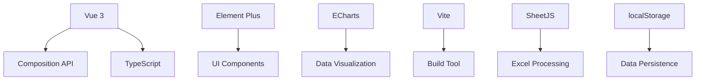
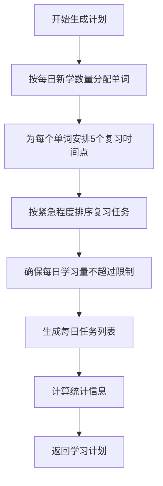

# 🛠️ 开发者文档

本文档为记忆单词学习计划工具的开发者提供技术指南，包括项目架构、API文档、开发规范等内容。

## 📚 目录

- [项目架构](#项目架构)
- [核心模块](#核心模块)
- [API文档](#api文档)
- [开发指南](#开发指南)
- [部署指南](#部署指南)
- [贡献指南](#贡献指南)

## 🏗️ 项目架构

### 技术栈概览



### 项目结构

```
rememberWords/
├── docs/                    # 文档目录
│   ├── USER_GUIDE.md       # 用户使用手册
│   └── DEVELOPER.md        # 开发者文档
├── public/                 # 静态资源
│   └── favicon.ico
├── src/                    # 源代码
│   ├── components/         # Vue组件
│   │   ├── DataImport.vue
│   │   ├── ParameterSettings.vue
│   │   └── PlanViewer.vue
│   ├── composables/        # 组合式函数
│   │   ├── useEbbinghaus.ts
│   │   ├── useExcel.ts
│   │   └── useStorage.ts
│   ├── types/              # 类型定义
│   │   ├── index.ts
│   │   └── excel.ts
│   ├── utils/              # 工具函数
│   │   └── sanitize.ts
│   ├── App.vue            # 主应用组件
│   └── main.ts            # 应用入口
├── package.json           # 项目配置
├── tsconfig.json         # TypeScript配置
├── vite.config.ts        # Vite配置
└── README.md             # 项目说明
```

### 架构设计原则

1. **组件化**：每个组件职责单一，可复用
2. **组合式API**：使用Vue 3 Composition API
3. **类型安全**：完整的TypeScript类型系统
4. **响应式设计**：支持多设备访问
5. **安全优先**：输入验证和XSS防护

## 🔧 核心模块详解

### useEbbinghaus - 艾宾浩斯算法

```typescript
/**
 * 艾宾浩斯遗忘曲线算法实现
 * 基于 1, 2, 4, 7, 15 天的复习间隔
 */
export function useEbbinghaus() {
  const plan = ref<StudyPlan | null>(null)
  const isGenerating = ref(false)

  /**
   * 生成学习计划
   * @param words 单词列表
   * @param settings 学习设置
   * @returns 学习计划对象
   */
  const generatePlan = (words: Word[], settings: StudySettings): StudyPlan => {
    // 算法实现
  }

  return {
    plan,
    isGenerating,
    generateStudyPlan,
    clearPlan
  }
}
```

**算法流程：**



### useExcel - Excel数据处理

```typescript
/**
 * Excel文件处理模块
 * 支持导入导出功能
 */
export function useExcel() {
  const isImporting = ref(false)
  const importProgress = ref(0)

  /**
   * 解析Excel文件
   * @param file Excel文件对象
   * @returns 解析结果
   */
  const parseExcelFile = async (file: File): Promise<ExcelImportResult> => {
    // 文件验证和解析逻辑
  }

  /**
   * 导出学习计划
   * @param plan 学习计划对象
   * @returns 导出是否成功
   */
  const exportStudyPlan = (plan: StudyPlan): boolean => {
    // 导出逻辑
  }

  return {
    isImporting,
    importProgress,
    parseExcelFile,
    exportStudyPlan,
    exportToExcel
  }
}
```

### useStorage - 数据持久化

```typescript
/**
 * 本地存储管理模块
 * 使用localStorage进行数据持久化
 */
export function useStorage() {
  // 响应式数据
  const words = ref<Word[]>(loadWords())
  const settings = ref<StudySettings>(loadSettings())
  const plan = ref<StudyPlan | null>(loadPlan())

  /**
   * 保存单词数据
   * @param words 单词列表
   */
  const saveWords = (words: Word[]): void => {
    localStorage.setItem(STORAGE_KEYS.WORDS, JSON.stringify(words))
  }

  /**
   * 清除所有数据
   */
  const clearAll = (): void => {
    localStorage.removeItem(STORAGE_KEYS.WORDS)
    localStorage.removeItem(STORAGE_KEYS.SETTINGS)
    localStorage.removeItem(STORAGE_KEYS.PLAN)

    // 重置响应式数据
    words.value.splice(0, words.value.length)
    settings.value = { ...DEFAULT_SETTINGS, startDate: getCurrentDate() }
    plan.value = null
  }

  return {
    // 响应式数据
    words,
    settings,
    plan,
    // 操作方法
    saveWords,
    saveSettings,
    savePlan,
    clearAll,
    // 工具方法
    checkStorageAvailability,
    getStorageUsage
  }
}
```

## 📝 API文档

### 核心类型定义

```typescript
// 基础类型
interface Word {
  id: string
  word: string
  meaning: string
}

interface StudySettings {
  period: number           // 学习周期（天）
  dailyNew: number        // 每日新学单词数
  maxReview: number       // 每日最大复习数
  startDate: string       // 起始日期
}

interface DailyTask {
  date: string            // 日期
  newWords: Word[]        // 新学单词
  reviewWords: Word[]     // 复习单词
}

interface StudyPlan {
  settings: StudySettings
  tasks: DailyTask[]
  originalWords: Word[]
}

// 结果类型
interface ExcelImportResult {
  success: boolean
  words?: Word[]
  error?: string}

// 统计类型
interface PlanStats {
  totalDays: number
  totalNewWords: number
  totalReviews: number
  totalStudyTasks: number
  dailyStats: DailyStats[]
  averageDailyLoad: number
}
```

### 主要函数接口

#### useEbbinghaus

```typescript
interface UseEbbinghausReturn {
  plan: Ref<StudyPlan | null>
  isGenerating: Ref<boolean>
  planStats: ComputedRef<PlanStats | null>
  generateStudyPlan: (words: Word[], settings: StudySettings) => Promise<void>
  clearPlan: () => void
}
```

#### useExcel

```typescript
interface UseExcelReturn {
  isImporting: Ref<boolean>
  importProgress: Ref<number>
  parseExcelFile: (file: File) => Promise<ExcelImportResult>
  exportToExcel: (data: ExcelRowData[], filename: string) => boolean
  exportStudyPlan: (plan: StudyPlan) => boolean
}
```

#### useStorage

```typescript
interface UseStorageReturn {
  words: Ref<Word[]>
  settings: Ref<StudySettings>
  plan: Ref<StudyPlan | null>
  saveWords: (words: Word[]) => void
  saveSettings: (settings: StudySettings) => void
  savePlan: (plan: StudyPlan) => void
  clearAll: () => void
  checkStorageAvailability: () => boolean
  getStorageUsage: () => StorageUsage
}
```

## 🚀 开发指南

### 环境要求

```bash
Node.js >= 16.0.0
npm >= 8.0.0
```

### 本地开发

```bash
# 克隆项目
git clone https://github.com/your-username/rememberWords.git
cd rememberWords

# 安装依赖
npm install

# 启动开发服务器
npm run dev

# 类型检查
npm run type-check

# 代码格式化
npm run format

# 代码检查
npm run lint
```

### 开发规范

#### 代码风格

- **组件命名**：PascalCase（如 `DataImport.vue`）
- **函数命名**：camelCase（如 `generateStudyPlan`）
- **常量命名**：UPPER_SNAKE_CASE（如 `EBBINGHAUS_INTERVALS`）
- **文件命名**：kebab-case（如 `use-ebbinghaus.ts`）

#### TypeScript规范

```typescript
// ✅ 正确的类型定义
interface StudySettings {
  period: number
  dailyNew: number
  maxReview: number
  startDate: string
}

// ✅ 函数类型注解
const generatePlan = (words: Word[], settings: StudySettings): StudyPlan => {
  // 实现
}

// ❌ 避免使用any
const processData = (data: any): any => {
  // 不要这样做
}

// ✅ 使用具体类型
const processData = (data: ExcelRowData[]): ProcessedData => {
  // 推荐做法
}
```

#### Vue组件规范

```vue
<template>
  <!-- 使用语义化的HTML标签 -->
  <main class="app-container">
    <header class="app-header">
      <!-- 内容 -->
    </header>
  </main>
</template>

<script setup lang="ts">
import { ref, computed, onMounted } from 'vue'
import type { Word } from '@/types'

// Props定义
interface Props {
  initialData?: Word[]
}

const props = withDefaults(defineProps<Props>(), {
  initialData: () => []
})

// Emits定义
const emit = defineEmits<{
  update: [data: Word[]]
  error: [message: string]
}>()

// 响应式数据
const loading = ref(false)
const error = ref('')

// 计算属性
const processedData = computed(() => {
  return props.initialData.map(item => ({
    ...item,
    processed: true
  }))
})

// 生命周期
onMounted(() => {
  // 初始化逻辑
})
</script>

<style scoped>
/* 使用BEM命名规范 */
.app-container {
  max-width: 1200px;
  margin: 0 auto;
}

.app-header {
  padding: 1rem;
}
</style>
```

### 测试策略

#### 单元测试

```typescript
// tests/composables/useEbbinghaus.test.ts
import { describe, it, expect, beforeEach } from 'vitest'
import { useEbbinghaus } from '@/composables/useEbbinghaus'

describe('useEbbinghaus', () => {
  let ebbinghaus: ReturnType<typeof useEbbinghaus>

  beforeEach(() => {
    ebbinghaus = useEbbinghaus()
  })

  it('should generate study plan correctly', () => {
    const words = [
      { id: '1', word: 'apple', meaning: '苹果' },
      { id: '2', word: 'book', meaning: '书' }
    ]
    const settings = {
      period: 30,
      dailyNew: 1,
      maxReview: 5,
      startDate: '2024-01-01'
    }

    const plan = ebbinghaus.generatePlan(words, settings)

    expect(plan.tasks).toHaveLength(30)
    expect(plan.originalWords).toEqual(words)
  })
})
```

#### 组件测试

```typescript
// tests/components/DataImport.test.ts
import { mount } from '@vue/test-utils'
import { describe, it, expect } from 'vitest'
import DataImport from '@/components/DataImport.vue'

describe('DataImport', () => {
  it('should render upload area', () => {
    const wrapper = mount(DataImport)
    expect(wrapper.find('.upload-demo').exists()).toBe(true)
  })

  it('should emit next event when data is imported', async () => {
    const wrapper = mount(DataImport)
    await wrapper.vm.goToSettings()
    expect(wrapper.emitted('next')).toBeTruthy()
  })
})
```

## 📦 部署指南

### 构建生产版本

```bash
# 构建生产版本
npm run build

# 预览生产版本
npm run preview
```

### Docker部署

```dockerfile
# Dockerfile
FROM node:18-alpine as build-stage

WORKDIR /app
COPY package*.json ./
RUN npm ci --only=production

COPY . .
RUN npm run build

FROM nginx:stable-alpine as production-stage
COPY --from=build-stage /app/dist /usr/share/nginx/html
COPY nginx.conf /etc/nginx/nginx.conf

EXPOSE 80
CMD ["nginx", "-g", "daemon off;"]
```

```yaml
# docker-compose.yml
version: '3.8'
services:
  remember-words:
    build: .
    ports:
      - "80:80"
    environment:
      - NODE_ENV=production
```

### Nginx配置

```nginx
# nginx.conf
events {
    worker_connections 1024;
}

http {
    include       /etc/nginx/mime.types;
    default_type  application/octet-stream;

    server {
        listen 80;
        server_name localhost;
        root /usr/share/nginx/html;
        index index.html;

        # 启用gzip压缩
        gzip on;
        gzip_types text/plain text/css application/json application/javascript text/xml application/xml application/xml+rss text/javascript;

        # 静态资源缓存
        location ~* \.(js|css|png|jpg|jpeg|gif|ico|svg)$ {
            expires 1y;
            add_header Cache-Control "public, immutable";
        }

        # SPA路由支持
        location / {
            try_files $uri $uri/ /index.html;
        }
    }
}
```

### 静态部署

#### Netlify

```toml
# netlify.toml
[build]
  publish = "dist"
  command = "npm run build"

[[redirects]]
  from = "/*"
  to = "/index.html"
  status = 200
```

#### Vercel

```json
// vercel.json
{
  "buildCommand": "npm run build",
  "outputDirectory": "dist",
  "cleanUrls": true,
  "trailingSlash": false,
  "routes": [
    {
      "src": "/(.*)",
      "dest": "/index.html"
    }
  ]
}
```

## 🤝 贡献指南

### 开发流程

1. **Fork项目**到你的GitHub账户
2. **创建特性分支**：`git checkout -b feature/amazing-feature`
3. **编写代码**并确保通过所有测试
4. **提交更改**：`git commit -m 'Add amazing feature'`
5. **推送分支**：`git push origin feature/amazing-feature`
6. **创建Pull Request**

### 提交规范

使用[Conventional Commits](https://conventionalcommits.org/)规范：

```bash
# 功能添加
git commit -m "feat: add user authentication"

# 问题修复
git commit -m "fix: resolve excel import issue"

# 文档更新
git commit -m "docs: update API documentation"

# 样式调整
git commit -m "style: improve button layout"

# 重构代码
git commit -m "refactor: optimize plan generation algorithm"

# 性能优化
git commit -m "perf: improve chart rendering performance"

# 测试相关
git commit -m "test: add unit tests for useExcel"
```

### 代码审查清单

#### 功能性
- [ ] 功能实现正确
- [ ] 边界情况处理
- [ ] 错误处理完善
- [ ] 性能表现良好

#### 代码质量
- [ ] 代码风格一致
- [ ] TypeScript类型完整
- [ ] 变量命名清晰
- [ ] 代码结构合理

#### 测试
- [ ] 单元测试通过
- [ ] 集成测试通过
- [ ] 测试覆盖率足够
- [ ] 手动测试验证

#### 文档
- [ ] API文档更新
- [ ] 注释说明清晰
- [ ] README更新
- [ ] 变更日志记录

### 问题报告

使用GitHub Issues报告问题时，请包含：

1. **问题描述**：详细说明遇到的问题
2. **复现步骤**：如何复现该问题
3. **期望结果**：期望的正常行为
4. **实际结果**：实际发生的情况
5. **环境信息**：浏览器、操作系统版本等
6. **相关截图**：如有需要，提供截图

### 开发环境配置

#### VS Code推荐插件

```json
// .vscode/extensions.json
{
  "recommendations": [
    "vue.volar",
    "bradlc.vscode-tailwindcss",
    "esbenp.prettier-vscode",
    "dbaeumer.vscode-eslint",
    "ms-vscode.vscode-typescript-next"
  ]
}
```

#### VS Code设置

```json
// .vscode/settings.json
{
  "editor.formatOnSave": true,
  "editor.defaultFormatter": "esbenp.prettier-vscode",
  "editor.codeActionsOnSave": {
    "source.fixAll.eslint": true
  },
  "typescript.preferences.importModuleSpecifier": "relative"
}
```

---

## 📞 联系方式

- **项目主页**：https://github.com/your-username/rememberWords
- **问题反馈**：https://github.com/your-username/rememberWords/issues
- **讨论区**：https://github.com/your-username/rememberWords/discussions

感谢您对项目的关注和贡献！🎉